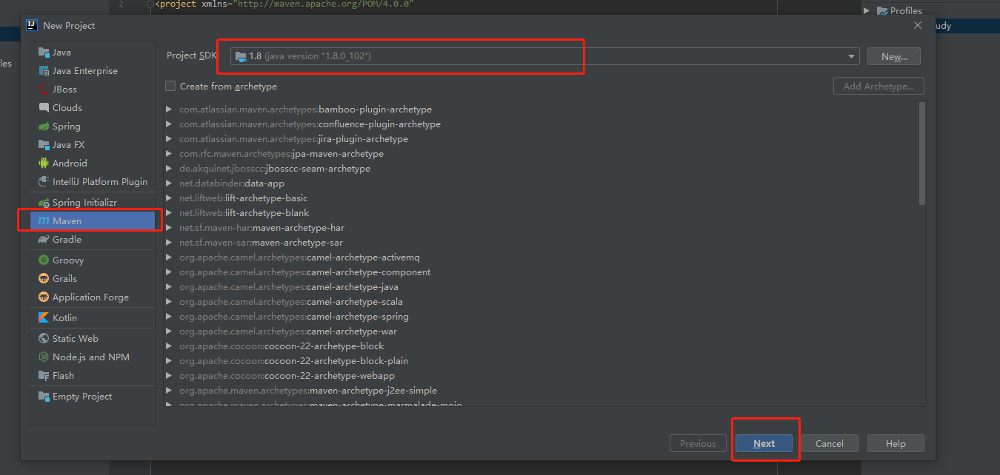

# Mybatis

官方文档：https://mybatis.org/mybatis-3/zh/configuration.html

## 创建第一个Mybatis程序

**练习项目路径：F:\java_workspace\mybatis_workspace\mybatis-Study**

### 创建maven项目

注意：maven使用3.6.1版本，其他版本会出现依赖下载不成功的情况

**创建成功后删除src目录**

### 导入maven依赖

在父工程的pom.xml中导入依赖

~~~xml
<?xml version="1.0" encoding="UTF-8"?>
<project xmlns="http://maven.apache.org/POM/4.0.0"
         xmlns:xsi="http://www.w3.org/2001/XMLSchema-instance"
         xsi:schemaLocation="http://maven.apache.org/POM/4.0.0 http://maven.apache.org/xsd/maven-4.0.0.xsd">
    <modelVersion>4.0.0</modelVersion>
    <!-- 父工程 -->
    <groupId>com.xzx</groupId>
    <artifactId>mybatis-Study</artifactId>
    <version>1.0-SNAPSHOT</version>
    
    <!-- 导入依赖 -->
    <dependencies>
        <!-- mysql8驱动 -->
        <dependency>
            <groupId>mysql</groupId>
            <artifactId>mysql-connector-java</artifactId>
            <version>8.0.16</version>
        </dependency>
        <!-- mybatis -->
        <dependency>
            <groupId>org.mybatis</groupId>
            <artifactId>mybatis</artifactId>
            <version>3.5.3</version>
        </dependency>
        <!-- junit -->
        <!-- https://mvnrepository.com/artifact/org.mybatis/mybatis -->
        <dependency>
            <groupId>junit</groupId>
            <artifactId>junit</artifactId>
            <version>4.12</version>
        </dependency>
    </dependencies>

</project>
~~~

### 创建模块

### 代码编写

参考文档：https://mybatis.org/mybatis-3/zh/configuration.html

#### 创建练习数据库

~~~mysql
CREATE DATABASE `mybatis_sql`;
USE `mybatis_sql`;

CREATE TABLE `user` (
	`id` INT(20) NOT NULL PRIMARY KEY,
	`name` VARCHAR(30) DEFAULT NULL,
	`pwd` VARCHAR(30) DEFAULT NULL
)ENGINE=INNODB DEFAULT CHARSET=utf8;

USE `mybatis_sql`;
INSERT INTO `user`(`id`, `name`, `pwd`) VALUES
(1, '小兰', '123456'),
(2, '小王', '123456'),
(3, '李四', 'root')
~~~

#### 编写mybatis核心配置文件

+ 在子模块（mybatis-01）中的resource目录创建mybatis-config.xml文件

+ 贴入如下代码

  ~~~xml
  <?xml version="1.0" encoding="UTF-8" ?>
  <!DOCTYPE configuration
          PUBLIC "-//mybatis.org//DTD Config 3.0//EN"
          "http://mybatis.org/dtd/mybatis-3-config.dtd">
  <!--核心配置文件-->
  <configuration>
      <environments default="development">
          <environment id="development">
              <transactionManager type="JDBC"/>
              <dataSource type="POOLED">
                  <property name="driver" value="com.mysql.cj.jdbc.Driver"/>
                  <property name="url" value="jdbc:mysql://localhost:3306/mybatis_sql?useSSL=true&amp;serverTimezone=UTC&amp;useUnicode=true&amp;characterEncoding=UTF-8"/>
                  <property name="username" value="root"/>
                  <property name="password" value="928587987"/>
              </dataSource>
          </environment>
          <environment id="test">
              <transactionManager type="JDBC"/>
              <dataSource type="POOLED">
                  <property name="driver" value="com.mysql.cj.jdbc.Driver"/>
                  <property name="url" value="jdbc:mysql://localhost:3306/mybatis_sql?useSSL=true&amp;serverTimezone=UTC&amp;useUnicode=true&amp;characterEncoding=UTF-8"/>
                  <property name="username" value="root"/>
                  <property name="password" value="928587987"/>
              </dataSource>
          </environment>
      </environments>
  
      <!-- 将编写后的mapper配置进来 -->
  <!--    <mappers>-->
  <!--        <mapper resource="org/mybatis/example/BlogMapper.xml"/>-->
  <!--    </mappers>-->
  </configuration>
  ~~~

#### 编写mybatis工具类

+ 在子模块的java目录中创建dao层和utils配置文件夹

+ 在utils文件夹中创建MybatisUtils类，并编写如下代码

~~~java
package com.xzx.utils;

import org.apache.ibatis.io.Resources;
import org.apache.ibatis.session.SqlSession;
import org.apache.ibatis.session.SqlSessionFactory;
import org.apache.ibatis.session.SqlSessionFactoryBuilder;

import java.io.IOException;
import java.io.InputStream;

// 从sqlSessionFactory工厂中构建sqlSession
public class MybatisUtils {
    private static SqlSessionFactory sqlSessionFactory;

    static {
        try {
            // 使用Mybatis第一步：获取SqlSessionFactory对象
            String resource = "mybatis-config.xml";
            InputStream inputStream = Resources.getResourceAsStream(resource);
            sqlSessionFactory = new SqlSessionFactoryBuilder().build(inputStream);
        } catch (IOException e) {
            e.printStackTrace();
        }
    }
    // SqlSession 完全包含了面向数据库执行SQL命令所需的所有方法
    public static SqlSession getSqlSession() {
        return sqlSessionFactory.openSession();
    }
}
~~~

#### Mybatis使用示例

##### 编写实体类

+ 创建pojo文件夹，创建User类

编写User实体

~~~java
package com.xzx.pojo;

public class User {
    private int id;
    private String name;
    private String pwd;

    public User() {
    }

    public User(int id, String name, String pwd) {
        this.id = id;
        this.name = name;
        this.pwd = pwd;
    }

    public int getId() {
        return id;
    }

    public void setId(int id) {
        this.id = id;
    }

    public String getName() {
        return name;
    }

    public void setName(String name) {
        this.name = name;
    }

    public String getPwd() {
        return pwd;
    }

    public void setPwd(String pwd) {
        this.pwd = pwd;
    }

    @Override
    public String toString() {
        return "User{" +
                "id=" + id +
                ", name='" + name + '\'' +
                ", pwd='" + pwd + '\'' +
                '}';
    }
}

~~~

##### 编写Dao接口

+ 在子模块的dao文件夹创建UserDao接口类

~~~java
package com.xzx.dao;

import com.xzx.pojo.User;
import java.util.List;

public interface UserDao {
    List<User> getUserList();
}
~~~

##### 编写接口实现类(由旧版本的UserDaoImpl类转为了Mapper配置文件)

+ 在子模块的dao文件夹创建UserMapper.xml文件

~~~xml
<?xml version="1.0" encoding="UTF-8" ?>
<!DOCTYPE mapper
        PUBLIC "-//mybatis.org//DTD Mapper 3.0//EN"
        "http://mybatis.org/dtd/mybatis-3-mapper.dtd">
<!-- namespace 绑定对应的Dao/Mapper接口 -->
<mapper namespace="com.xzx.dao.UserDao">
    <!-- id 对应的Dao/Mapper接口中需要重写的方法 -->
    <select id="getUserList" resultType="com.xzx.pojo.User">
    select * from mybatis_sql.user
  </select>
</mapper>

<!-- 编写完一个mapper后，记得在mybatis的核心配置文件mybatis-config.xml中进行配置 -->
~~~

#### 编写测试代码

+ 在子模块的test目录创建与项目目录一致的测试目录

+ 通过mybatis工具类获取SqlSession对象进行测试

~~~java
package com.xzx.dao;

import com.xzx.pojo.User;
import com.xzx.utils.MybatisUtils;
import org.apache.ibatis.session.SqlSession;
import org.junit.Test;

import java.util.List;

public class UserDaoTest {
    @Test
    public void test() {
        // 获取SqlSession对象
        SqlSession sqlSession = MybatisUtils.getSqlSession();

        // 方式一：getMapper (推荐)
        UserDao userDao = sqlSession.getMapper(UserDao.class);
        List<User> userList = userDao.getUserList();

        // 方式二： 不推荐使用
//        List<User> userList = sqlSession.selectList("com.xzx.dao.UserDao.getUserList");

        for (User user : userList) {
            System.out.println(user);
        }

        // 关闭SqlSession
        sqlSession.close();
    }
}

~~~

#### 报错

##### 初始化xml文件错误，由于IDEA里只分析resource里的文件，而UserMapper.xml并不是放置在resource里，所以会报错。

**解决方法：**

+ 第一种方式：将UserMapper.xml文件放在resource文件夹里，同时修改配置进mybatis核心配置文件（mybatis-config.xml）内的mapper标签

~~~xml
<?xml version="1.0" encoding="UTF-8" ?>
<!DOCTYPE configuration
        PUBLIC "-//mybatis.org//DTD Config 3.0//EN"
        "http://mybatis.org/dtd/mybatis-3-config.dtd">
<!--核心配置文件-->
<configuration>
    <environments default="development">
        <environment id="development">
            <transactionManager type="JDBC"/>
            <dataSource type="POOLED">
                <property name="driver" value="com.mysql.cj.jdbc.Driver"/>
                <property name="url" value="jdbc:mysql://localhost:3306/mybatis_sql?useSSL=true&amp;serverTimezone=UTC&amp;useUnicode=true&amp;characterEncoding=UTF-8"/>
                <property name="username" value="root"/>
                <property name="password" value="928587987"/>
            </dataSource>
        </environment>
        <environment id="test">
            <transactionManager type="JDBC"/>
            <dataSource type="POOLED">
                <property name="driver" value="com.mysql.cj.jdbc.Driver"/>
                <property name="url" value="jdbc:mysql://localhost:3306/mybatis_sql?useSSL=true&amp;serverTimezone=UTC&amp;useUnicode=true&amp;characterEncoding=UTF-8"/>
                <property name="username" value="root"/>
                <property name="password" value="928587987"/>
            </dataSource>
        </environment>
    </environments>

    <!-- 修改resource文件内路径文件 -->
    <mappers>
        <mapper resource="UserMapper.xml"/>
    </mappers>
</configuration>
~~~

+ 第二种方式：将如下代码贴入父工程和子模块的pom.xml文件内

~~~xml
<!-- 在build中配置resources, 以防止我们资源导出失败的问题 -->
    <build>
        <resources>
            <resource>
                <directory>src/main/resources</directory>
                <includes>
                    <include>**/*.properties</include>
                    <include>**/*.xml</include>
                </includes>
                <filtering>false</filtering>
            </resource>
            <resource>
                <directory>src/main/java</directory>
                <includes>
                    <include>**/*.properties</include>
                    <include>**/*.xml</include>
                </includes>
                <filtering>false</filtering>
            </resource>
        </resources>
    </build>
~~~

完整pom.xml如下

~~~xml
<?xml version="1.0" encoding="UTF-8"?>
<project xmlns="http://maven.apache.org/POM/4.0.0"
         xmlns:xsi="http://www.w3.org/2001/XMLSchema-instance"
         xsi:schemaLocation="http://maven.apache.org/POM/4.0.0 http://maven.apache.org/xsd/maven-4.0.0.xsd">
    <modelVersion>4.0.0</modelVersion>

    <!-- 父工程 -->
    <groupId>com.xzx</groupId>
    <artifactId>mybatis-Study</artifactId>
    <packaging>pom</packaging>
    <version>1.0-SNAPSHOT</version>

    <!--创建模块时会自动导入-->
    <modules>
        <module>mybatis-01</module>
    </modules>

    <!-- 导入依赖 -->
    <dependencies>
        <!-- mysql驱动 -->
        <dependency>
            <groupId>mysql</groupId>
            <artifactId>mysql-connector-java</artifactId>
            <version>8.0.16</version>
        </dependency>
        <!-- mybatis -->
        <dependency>
            <groupId>org.mybatis</groupId>
            <artifactId>mybatis</artifactId>
            <version>3.5.3</version>
        </dependency>
        <!-- junit -->
        <!-- https://mvnrepository.com/artifact/org.mybatis/mybatis -->
        <dependency>
            <groupId>junit</groupId>
            <artifactId>junit</artifactId>
            <version>4.12</version>
        </dependency>

    </dependencies>

    <!-- 在build中配置resources, 以防止我们资源导出失败的问题 -->
    <build>
        <resources>
            <resource>
                <directory>src/main/resources</directory>
                <includes>
                    <include>**/*.properties</include>
                    <include>**/*.xml</include>
                </includes>
                <filtering>false</filtering>
            </resource>
            <resource>
                <directory>src/main/java</directory>
                <includes>
                    <include>**/*.properties</include>
                    <include>**/*.xml</include>
                </includes>
                <filtering>false</filtering>
            </resource>
        </resources>
    </build>
</project>
~~~

#### 运行结果

## CRUD

参考代码：F:\java_workspace\mybatis_workspace\mybatis-Study\mybatis-01

## 配置解析

### 核心配置文件

mybatis-config.xml

### 环境配置 （environments）

### 属性 （properties）

### 类型别名 （typeAliases）

### 设置 （settings）

### 其他配置

### 映射器 （mappers）

### 生命周期和作用域

每一个mapper代表一个具体的业务。

### ResultMap

**解决属性名和字段名不一致的问题，即数据库表中的字段名与Java实体类中的字段名不一致时，会造成获取的数据为null.**

参考代码：F:\java_workspace\mybatis_workspace\mybatis-Study\mybatis-03

## Teacher and Student 表创建
~~~sql
create table `teacher` (
`id` INT(10) NOT NULL,
`name` VARCHAR(30) DEFAULT NULL,
PRIMARY KEY (`id`)
) ENGINE=INNODB DEFAULT CHARSET=utf8

INSERT INTO teacher(`id`, `name`) VALUES (1, '秦老师');

create table `student` (
`id` INT(10) NOT NULL,
`name` VARCHAR(30) DEFAULT NULL,
`tid` INT(10) DEFAULT NULL,
PRIMARY KEY (`id`),
KEY `fktid` (`tid`),
CONSTRAINT `fktid` FOREIGN KEY (`tid`) REFERENCES `teacher` (`id`)
) ENGINE=INNODB DEFAULT CHARSET=utf8

INSERT INTO `student` (`id`, `name`, `tid`) VALUES ('1', '小明', '1');
INSERT INTO `student` (`id`, `name`, `tid`) VALUES ('2', '小红', '1');
INSERT INTO `student` (`id`, `name`, `tid`) VALUES ('3', '小张', '1');
INSERT INTO `student` (`id`, `name`, `tid`) VALUES ('4', '小李', '1');
INSERT INTO `student` (`id`, `name`, `tid`) VALUES ('5', '小王', '1');
~~~